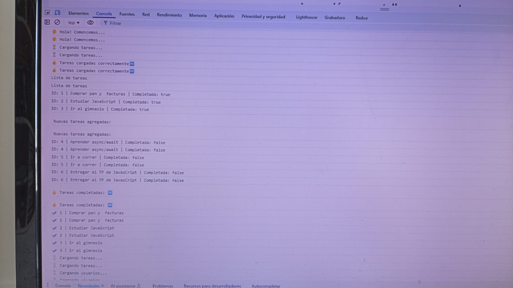
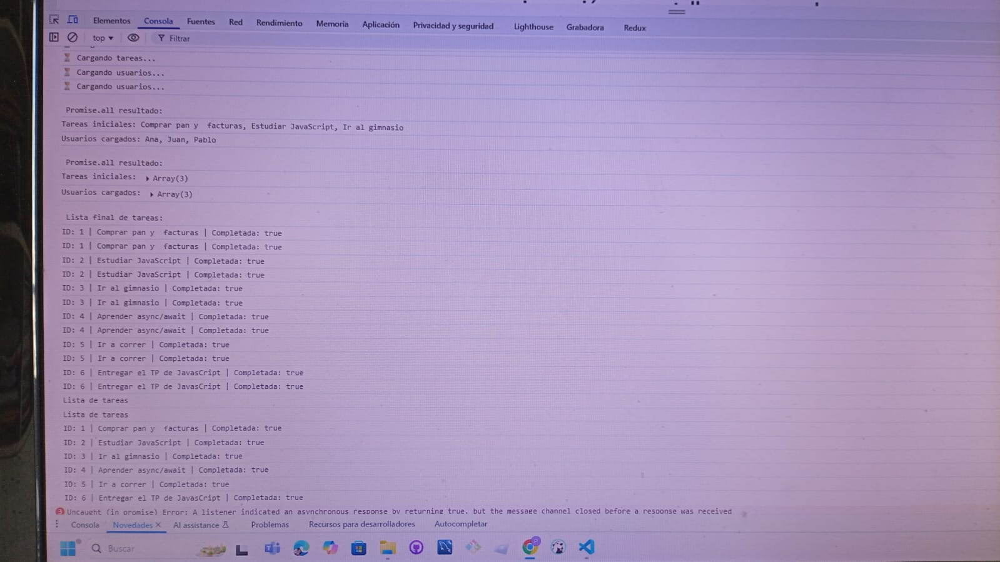
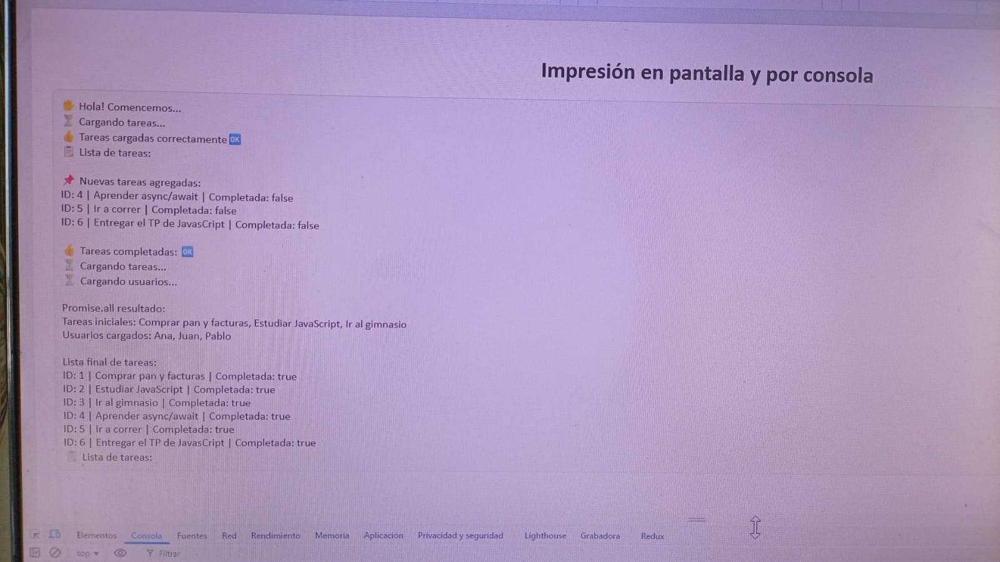

# 📋 Proyecto de Gestión de Tareas (JavaScript)

Este proyecto es un ejemplo práctico de **uso de clases, asincronía y manipulación de datos en JavaScript**.  
Permite gestionar una lista de tareas, imprimir información en consola y en pantalla, simular la carga de datos de manera asíncrona, y aplicar métodos como `map`, `filter`, `find` y `Promise.all`.

---

## 🎯 Breve descripción y objetivos

- Practicar el uso de **clases en JavaScript** (`Tarea` y `GestorTareas`).
- Implementar **asincronía** con `Promise` y `async/await`.
- Simular operaciones de carga de tareas y usuarios.
- Mostrar resultados tanto en **la consola** como en **la interfaz HTML**.
- Aplicar operaciones con arrays: `map`, `filter`, `find`, etc.

---

## ⚙️ Instrucciones de instalación y ejecución

1. Clona o descarga este repositorio en tu computadora.
2. Asegúrate de tener un navegador actualizado (Chrome, Firefox, Edge).
3. Abre el archivo `index.html` en tu navegador.
4. Abre también la **consola del navegador** (F12 o `Ctrl + Shift + I`) para ver los mensajes.

📂 Estructura del proyecto:
├── index.html
├── styles.css
└── script.js

---

## 🖥️ Capturas de pantalla

### Ejemplo en consola:

🖐️ Hola! Comencemos...
⏳ Cargando tareas...
👍 Tareas cargadas correctamente🆗
📋 Lista de tareas:
ID: 1 | Comprar pan y facturas | Completada: true
ID: 2 | Estudiar JavaScript | Completada: true
ID: 3 | Ir al gimnasio | Completada: true
📌 Nuevas tareas agregadas:
ID: 4 | Aprender async/await | Completada: false
ID: 5 | Ir a correr | Completada: false
ID: 6 | Entregar el TP de JavaScript | Completada: false
👍 Tareas completadas: 🆗
✔️ Comprar pan y facturas
✔️ Estudiar JavaScript
✔️ Ir al gimnasio

### Ejemplo en pantalla (HTML):

---

## 👨‍💻 Créditos del autor

- Proyecto desarrollado por: Pablo Caparelli
- Curso/Práctica de: **JavaScript - Asincronía y Clases**
  📅 Año: **2025**
  Diplomatura en Professional Full-Stack Developer
